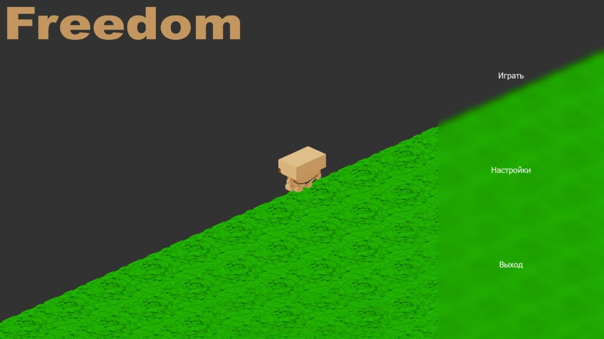
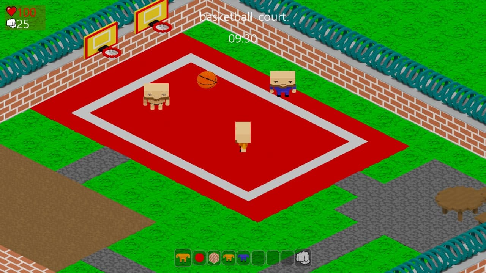
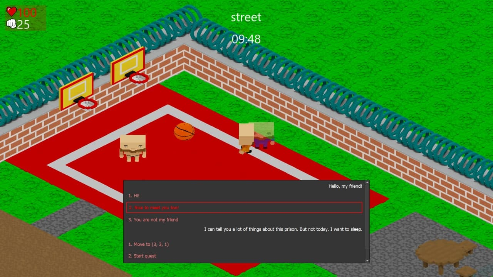
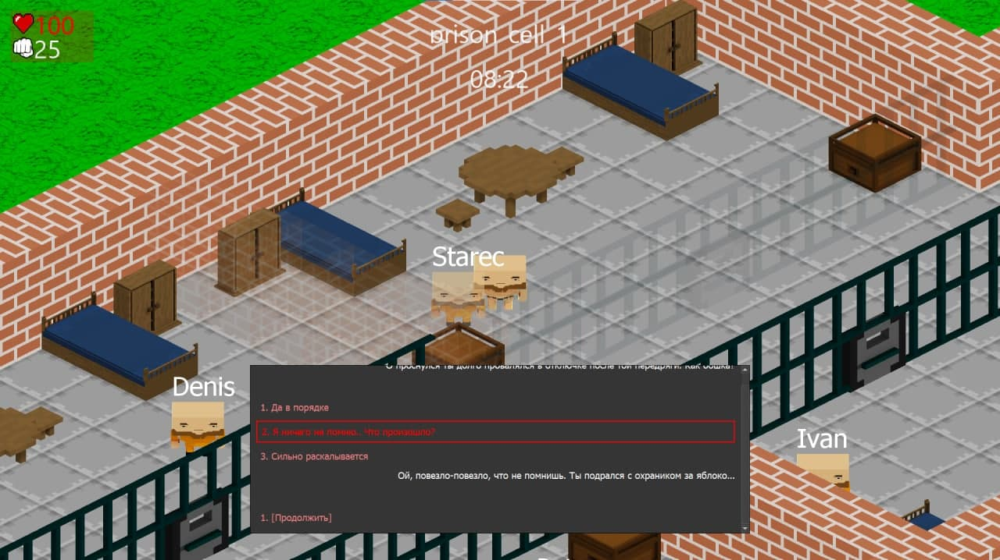

# Freedom

[Английская версия README](README.md)

Freedom - игра, разработанная на языке С++ с использованием фреймворка QT. Основной целью проекта является освоение навыков командной работы, разработки проектов и программирования с использованием __C++/QT__.

---
 
 

## Содержание

* [Сюжет](#Сюжет)
* [Технологии](#Технологии)
* [Установка](#Установка)
* [Авторы](#Авторы)

## Сюжет
После изнурительной драки за яблоко с охранником тюрьмы вы просыпаетесь в 
своей камере и понимаете, что жить так больше нет сил и бежать нужно любой 
ценой. К счастью, в этой тюрьме у вас будет такая возможность. Всего-то нужно сломать толстые стены или убить всех охранников. Разговаривайте со своими сокамерниками и надзирателями, выполняйте квесты, исследуйте локации и станьте первым среди равных!

## Технологии
* Система __квестов и диалогов__ позволяет создавать очень гибкие 
  сюжетные линии.
* Графический интерфейс и отрисовка игровых объектов реализована при помощи 
  стандартных наборов для рисования QT в комбинации с __OpenGL__.
* Вся анимация, внешний вид игровых объектов и персонажей разрабатывались при 
  помощи _MagicaVoxel_.
* Игра использует __изометрическую графику__, для которой были реализованы 
  собственные специальные методы рисования объектов.
* Архитектура приложения основана на паттерне __MVC__ (Model-View-Controller).
* Для менеджмента ресурсов был использован ресурсный файл `resources.qrc`, а для 
  хранения данных файлы формата `.json`. За счёт использования `json-`ов 
  значительно увеличилась скорость разработки и наполнения игры различным 
  контентом (квестами, диалогами и т.д.).
* __Гибкая система анимаций__ игровых объектов позволяюет анимировать 
  объекты по совершенно любым состояниям.
* __Боты и различные виды логических взаимодействий__ с ними: драка, 
  патрулирование, преследование героя, построение пути, диалоги, лутание вещей.

## Установка
Для установки игры вам необходимо скачать архив, расположенный в папке 
`Releases`, распаковать его и запустить исполняемый файл `Freedom.exe`. 
На данный момент наша игра доступна для ОС Windows, Linux и MacOS.

## Авторы

**[Арсений Тылецкий](https://github.com/ArseniyTy)**

**[Егор Желткевич](https://github.com/HydeHunter2)**

**[Георгий Кровш](https://github.com/gosha-krovsh)**

**[Максим Лицкевич](https://github.com/Zzzabiyaka)**