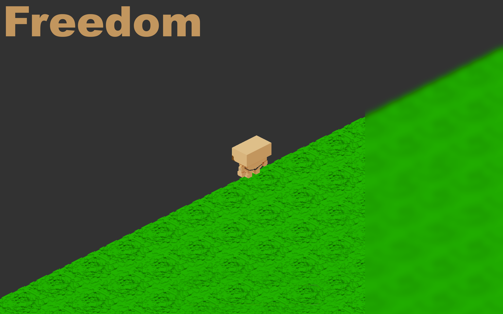

# Freedom

Freedom - игра, разработанная нами (см. Авторы) на языке С++ с использованием
фреймворка QT. Основной целью проекта является 
освоение навыков командной разработки и разработки проектов с использованием C++/QT.

## Содержание

* [Сюжет](#Сюжет)
* [Технологии](#Технологии)
* [Установка](#Установка)
* [Авторы](#Авторы)

## Сюжет
Итак, после изнурительной драки за яблоко с охранником тюрьмы вы просыпаетесь в своей камере
и понимаете, что жить так больше нет сил и бежать нужно любой ценой. К счастью, в этой
тюрьме у вас будет такая возможность. Всего-то нужно сломать эти толстые стены или убить
всех охранников. Разговаривайте со своими сокамерниками и надзирателями, 
выполняйте квесты, исследуйте локации и станьте первым среди равных!

## Технологии
* Графический интерфейс и отрисовка игровых объектов реализована при помощи стандартных наборов для рисования в QT в комбинации с OpenGL
* Вся анимация и внешний вид игровых объектов и героев разрабатывался при
помощи MagicaVoxel.
* Архитектура приложения основана на паттерне MVC (Model-View-Controller).
* Для менеджера ресурсов использовали ресурсный файл `resources.qrc` а для хранения
данных файлы формата `.json`.(см. папку `Jsons`).
* За счёт использования `json-`ов значительно увеличилась скорость разработки и наполнения
  игры различным контентом(квестами, диалогами и т.д.).
* Игра использует изометрическую графику,
  для которой были реализованы специальные методы рисования объектов

## Установка
Для установки игры вам нужно скачать архив, расположенный в папке `Releases`, распаковать
его и запустить исполняемый файл (`Freedom.exe`). На данный момент наша игра доступна для
ОС Windows, Linux и MacOS.

## Авторы
**Арсений Тылецкий**

**Егор Желткевич**

**Георгий Кровш**

**Максим Лицкевич**